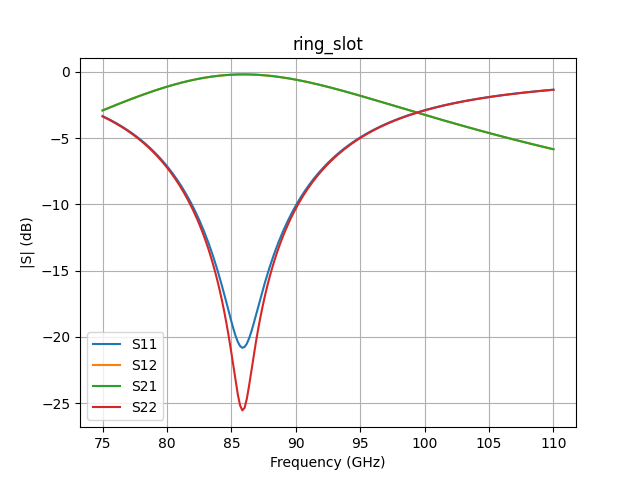

# si-ml-toolkit

> Machine learning toolkit for signal integrity (SI) analysis. Parse Touchstone files, predict eye diagram quality, and detect impedance discontinuities using deep learning.



## Motivation

High-speed digital interfaces in AI accelerators, HBM memory, and modern SoCs are increasingly bottlenecked by signal integrity. Traditional SI analysis relies on expert intuition and slow simulation loops. This toolkit explores how machine learning can augment SI workflows — from feature extraction on S-parameters to automated quality classification of eye diagrams.

## Quick example

```python
from siml.io import load_s2p
from siml.viz import plot_s_db

net = load_s2p("data/raw/ring_slot.s2p")
fig = plot_s_db(net, parameters=["s11", "s21"], save_path="channel.png")
```

## Features

Currently working:

- 📂 **Touchstone parsing** — Load `.s1p`, `.s2p`, `.s4p` files via `scikit-rf`
- 📈 **S-parameter visualization** — Plot in dB scale, with selectable parameters
- ✅ **Tested** — Unit tests for I/O and visualization layers

Planned:

- 🔬 **Feature extraction** — Insertion loss, return loss, TDR-based features
- 👁️ **Eye diagram classifier** — CNN model to predict pass/fail from eye diagram images
- 📍 **Impedance discontinuity locator** — Regression model to identify location of impedance mismatches
- 📊 **Streamlit dashboard** — Upload a Touchstone file, get instant ML-driven analysis

## Tech Stack

- Python 3.11
- PyTorch 2.5 (CUDA 12.1)
- scikit-rf for RF/SI data handling
- scikit-learn, pandas, numpy
- Streamlit for the web demo

## Status

🚧 Under active development. Started May 2026. Foundational I/O and visualization layers complete; feature extraction and ML models are next.

## About

Built by a hardware engineer with 5 years of experience in signal/power integrity, package, and PCB design at Samsung Electronics — as part of a transition into ML-augmented hardware engineering.

## License

MIT
