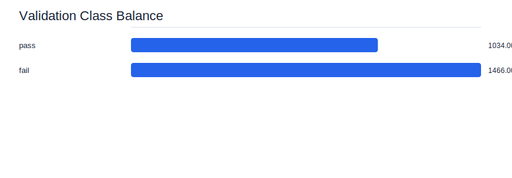
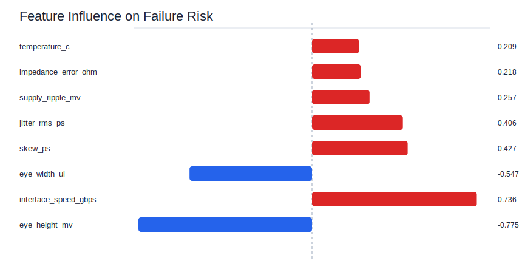
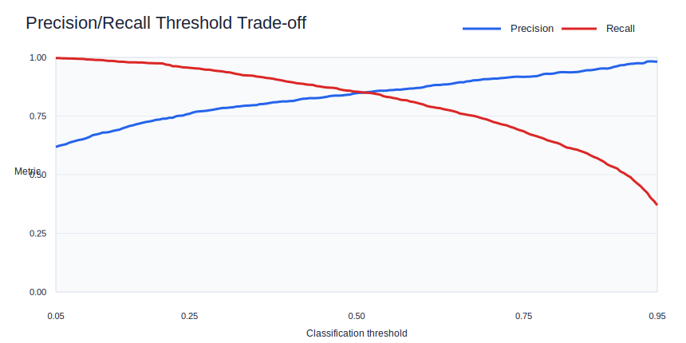
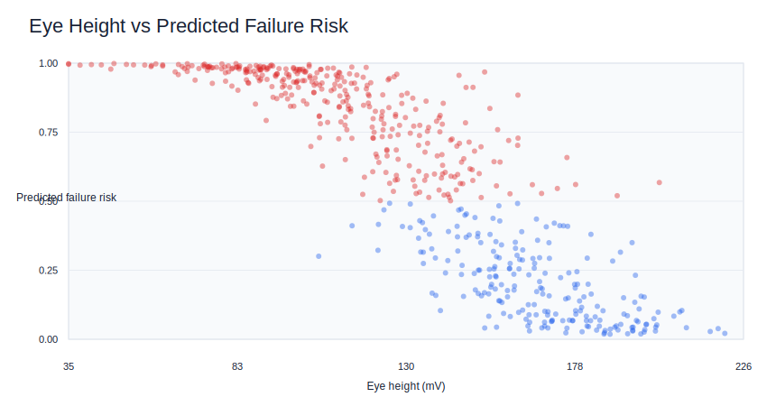

# Signal Integrity Validation Risk Baseline

This example trains a lightweight ML baseline that predicts whether a high-speed interface validation case is likely to fail.

It is designed as a hardware-aware AI/ML portfolio project that connects directly to signal-integrity validation work:

- eye-diagram margin screening
- skew and trace-length control
- jitter, impedance, supply ripple, and temperature sensitivity
- validation triage where missed failures are more expensive than extra debug candidates

## Why This Example Exists

The main `si-ml-toolkit` project focuses on signal-integrity analysis utilities such as Touchstone parsing, S-parameter visualization, and channel waveform generation.

This example adds the first ML workflow layer: turning hardware validation measurements into a supervised pass/fail risk model.

## What It Does

The training script:

1. Generates a synthetic hardware validation dataset.
2. Standardizes SI-related features.
3. Trains logistic regression from scratch with NumPy.
4. Evaluates accuracy, precision, recall, and F1 score.
5. Tunes an operating threshold for high-recall validation screening.
6. Writes a Markdown model report and CSV outputs.

The visualization script:

1. Rebuilds the same deterministic baseline run.
2. Generates SVG charts that GitHub can render directly.
3. Shows class balance, feature influence, threshold trade-offs, and the relationship between eye height and predicted failure risk.

## Features

The synthetic dataset includes:

- `interface_speed_gbps`
- `eye_height_mv`
- `eye_width_ui`
- `skew_ps`
- `jitter_rms_ps`
- `impedance_error_ohm`
- `supply_ripple_mv`
- `temperature_c`

Target:

- `validation_fail`

## Quick Start

From this example directory:

```powershell
python -m venv .venv
.\.venv\Scripts\Activate.ps1
pip install -r requirements.txt
python .\train_signal_integrity_model.py
python .\visualize_results.py
```

Outputs are written to `outputs/`:

- `signal_integrity_dataset.csv`
- `predictions.csv`
- `model_report.md`
- `figures/*.svg`

## Current Baseline Result

With the fixed random seed in the script:

- Accuracy: `0.844`
- Precision: `0.890`
- Recall: `0.856`
- F1 score: `0.873`
- High-recall threshold: `0.43`
- High-recall recall: `0.901`

## Visual Results

### Validation Class Balance



### Feature Influence



### Precision/Recall Threshold Trade-off



### Eye Height vs Predicted Failure Risk



## Study Notes

For the learning path behind this example, see [learning_notes.md](learning_notes.md).

## Portfolio Message

> I can translate hardware validation problems into measurable ML tasks and build models that support engineering decisions under real system constraints.

## Next Steps

1. Replace the synthetic dataset with public eye-diagram, PCB, wafer, or sensor-quality data.
2. Add a scikit-learn baseline and compare it against the NumPy implementation.
3. Add ROC/PR-AUC metrics and compare threshold choices.
4. Package the model as a small FastAPI inference service.
5. Add ONNX or edge-deployment benchmarking for a hardware-aware AI track.
